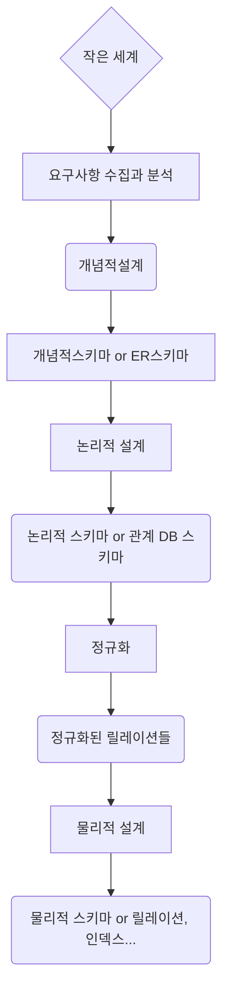

## Conceptual Design

   - ER Model

**Logical Design**

* Taking into account the characteristics of the DBMS
* In a relational DBMS, the ER schema is mapped to relations

**Physical Design**

* Consideration of hardware and operating system characteristics
* Performance requirements


**Requirements Analysis**

* Review existing documents and conduct interviews or surveys
* Based on knowledge of the requirements
    * Identify the relevant entities and their attributes
    * Determine the relationships between entities


* The process of constructing a model of the information used within an organization, independent of physical considerations
* Representative data model: ER model
* Identifies entity types, relationship types, and attributes
* The completed conceptual schema (ER schema) is represented as an **ER diagram**


## ER Model

ER (Entity-Relationship) Model


<br/>

* If a value is incorrect for a given attribute, append **"_"** to the attribute name


### Entity

* An entity is a real-world object that exists independently and can be uniquely identified, such as a **person, place, thing, or event**
* Some entities are concrete, such as an employee, while others are abstract, such as a course   


## Attributes

* An entity is a set of associated attributes
  * Example: The Employee entity contains attributes such as employee ID, name, job title, and salary

   - Indicated by an ellipse

  * Special attributes
 * Composite attributes
 * Multi-valued attributes
 * Derived attributes


## Relationships

* A relationship is a connection between entities

* In requirements analysis, verbs are represented as relationships in ER diagrams

* Represented by a diamond in an ER diagram

  

  ### Binary Relationship

  * Joining two tables

    Ex) Join the Department and Employee tables using the "Works At" relationship

  

  

  ```
  erDiagram
  추후에 추가
  ```

  

  <br/>


* Example

   - Department table:

      * Department Number

      * Department Name

      * Location

        

   - Employee table:

      * Employee ID
 * Name
 * Social Security Number
 * Job Title
 * Address
 * City, District, Neighborhood, Apartment Number...
 * Age
 * ...

     <br/>

```
erDiagram
추후에 추가
```


```
erDiagram
추후에 추가
```

```
erDiagram
추후에 추가
```


* For addresses in the employee table, all information—including city, district, and neighborhood—is required.

  This is called a composite attribute

* Age can be determined using the resident registration number

  This is called a derived attribute

  


## Cardinality

* Classify relationships as 1:1, 1:N, and M:N

* In the case of the "Department" and "Employee" tables above, the "Department" table contains multiple "Employees."

  In terms of a relationship, this is a 1:N relationship.

* Furthermore, when representing a school database using an ERD, the relationship between courses and students is represented as a many-to-many (M:N) relationship.
* 


## Reference Documents

https://www.edrawsoft.com/er-diagram-symbols.html


