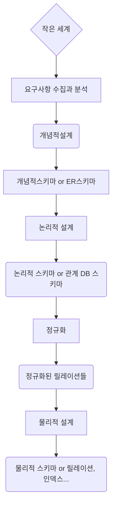

## 概念設計

   - ERモデル

**論理設計**

* DBMSの特性を考慮
* リレーショナルDBMSでは、ERスキーマをリレーションに写像する

**物理設計**

* ハードウェア／オペレーティングシステムの特性を考慮
* 性能上の要件


**要件分析**

* 既存の文書を調査し、インタビューやアンケート調査を行う
* 要件に関する知識に基づき
    * 関連するエンティティとその属性が何か
    * エンティティ間の関係を把握する


* 物理的な要素とは独立して、ある組織で使用される情報のモデルを構築するプロセス
* 代表的なデータモデル：ERモデル
* エンティティ型、関係型、属性などを特定する
* 完成した概念スキーマ（ERスキーマ）は、**ER図**として表現される


## ERモデル

ER（エンティティ・リレーション）モデル


<br/>

* 各値に誤った値が含まれている場合は、その属性の下に **"_"** を付加する


### エンティティ

* エンティティとは、**人、場所、物、出来事**など、独立して存在し、一意に識別可能な現実世界の対象のこと
* 従業員のように実体のあるものもあれば、受講のように抽象的なものも存在する   


## 属性

* 1つのエンティティは、関連する属性の集合である
  * 例）社員エンティティは、社員番号、氏名、役職、給与などの属性を有する

   - 楕円で表示

  * 特殊な属性
 * 複合属性
 * 多値属性
 * 派生属性


## 関係

* 関係とは、エンティティ間に存在する結びつきのこと

* 要件分析において、動詞はER図では関係として表現される

* ER図ではひし形で表される

  

  ### 二項関係

  * 2つのテーブルを結合すること

    例）部署テーブルと従業員テーブルを「勤務先」で関連付ける

  

  

  ```
  erDiagram
  추후에 추가
  ```

  

  <br/>


* 例

   - 部署テーブル：

      * 部署番号

      * 部署名

      * 場所

        

   - 従業員テーブル：

      * 社員番号
 * 氏名
 * 住民登録番号
 * 役職
 * 住所
 * 市、区、町、番地……
 * 年齢
 * ……

     <br/>

```
erDiagram
추후에 추가
```


```
erDiagram
추후에 추가
```

```
erDiagram
추후에 추가
```


* 従業員テーブルの住所については、市、区、町などのすべての情報が必要となります

  これを複合属性と呼ぶ

* 年齢については、住民登録番号から算出可能です

  これを誘導属性と呼ぶ

  


## カーディナリティ

* 関係を1対1、1対N、M対nに分類する

* 上記の「部署」テーブルと「従業員」テーブルの場合、「部署」というテーブルに複数の「従業員」が存在する構成となっている

  これを関係として表すと、1対Nの関係となる。

* また、学校のデータベースをERDで表すと、「科目」と「生徒」の関係はM:Nの関係として表される。
* 


## 参考資料

https://www.edrawsoft.com/er-diagram-symbols.html


