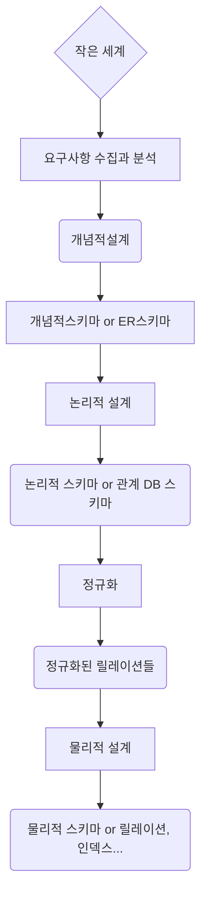
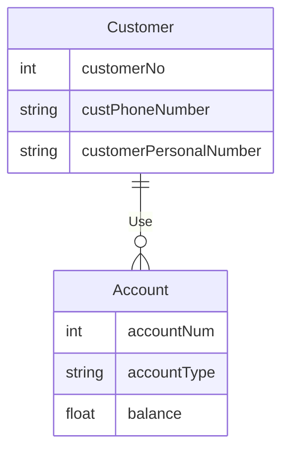

 

## First-order relationship

(9:20)

 

## Multiple Relationships

## Weak Entity

- An entity that lacks sufficient attributes to form a key
- Represented by a double-lined rectangle
- Partial key
  - An attribute that may be unique among dependents belonging to a single employee (such as a dependent’s name) but may be shared among all dependents of all employees in the company
  - Partial keys are indicated by a dotted underline

## Writing Roles

- Written on the edge to clarify the meaning when it is a first-order relationship

## ERD Example

1. 

Bank B requires **customer ID, name, social security number, and contact information** for customer management purposes.

To manage your account, you will need your **account number, account type, and balance**.

A single customer may hold multiple accounts, and a single account is owned by a single customer.

- This example has a 1:3 1:N ratio

 

2.

- The company has a large number of employees

- Store the following information for each employee: **employee ID (unique), name, job title, salary, and address**  

  - Addresses are broken down by city, district, and neighborhood

  

- Each employee *may have* zero or more dependents - The Company

  -  A single dependent cannot be associated with more than one employee X
  - For each dependent, store the dependent's **name and gender** - **weak entity**

  

- The company is currently working on several projects

  - For each project, it displays the **project number (unique), name, budget, and **location** where the project is being carried out
  - A single project can be carried out at multiple locations
  - Each project has multiple employees
  - Each employee can work on multiple projects; it indicates what **role** they perform in a given project and how long they have **worked** there
  - Each project has one project manager **->** No separate entry for X (employee)
  - An employee cannot serve as a project manager for more than one project; the **date** they began their duties as a project manager is recorded

  

- Each employee belongs to only one department

  - For each department, displays the **department number (unique), name, and floor**

  

- Each project requires parts

  - A single part can be used in two or more projects
  - A single part can consist of multiple other parts
  - For each part, **the part number (unique), name, and price** are displayed, and if the part includes other parts, information about those parts is also shown

  

- There are suppliers for each component

  - A single supplier can supply multiple parts
  - Each part can be supplied by multiple suppliers
  - For each supplier, the following information is displayed: **supplier ID (unique), name, and credit rating**
  - For each supplier, the system shows which parts they supply, for which projects, and in what quantities

- **The company itself is not an entity**

 

