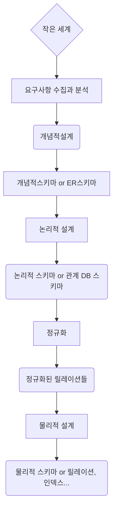
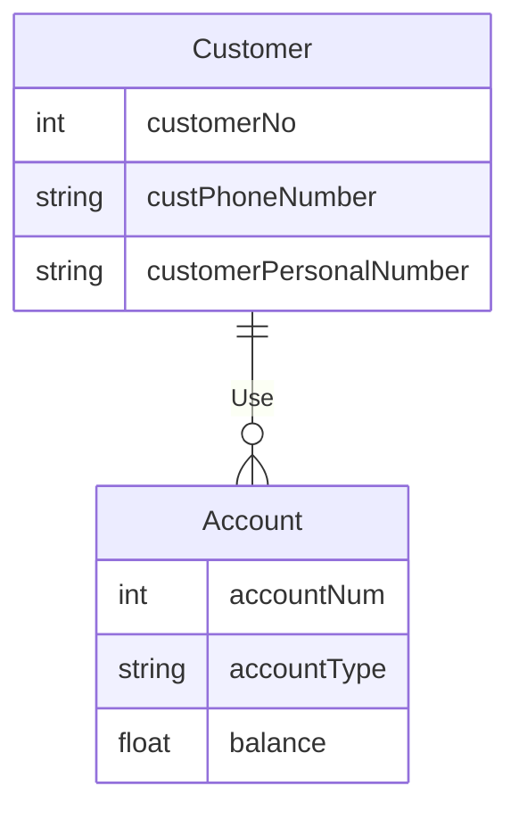

 

## 第一関係

(9:20)

 

## 多重関係

## 弱いエンティティ

- キーを構成するのに十分な属性を持たないエンティティ
- 二重線の四角形で表記
- 部分キー（partial key）
  - 扶養家族の名前のように、ある社員に属する扶養家族内では互いに異なるが、会社全体の社員の扶養家族全体では同じになる場合がある属性
  - 部分キーは点線の下線を引いて表示する

## 役割の記述

- 1次関係の場合、意味を明確にするために辺の上に表記する

## ERDの例

1.

B銀行では、顧客管理のために**顧客ID、氏名、住民登録番号、連絡先情報**が必要となります

​  口座管理のため、**口座番号、口座の種類、残高**の情報が必要です

​  1人の顧客は複数の口座を保有することができ、1つの口座は1人の顧客が所有します

- この例は1対3の1対Nの比率となっています

 

2.

- 当社には多数の社員が在籍している

- 各社員について、**社員番号（固有）、氏名、役職、給与、住所**を保存  

  - 住所は市、区、町・町内会単位で表示する

  

- 各社員は0人以上の扶養家族を*持つことができる* - 同社

  -  1人の扶養家族は、2人以上の従業員に属してはならない X
  - 各扶養家族について、扶養家族の**氏名、性別**を保存 - **弱いエンティティ**

  

- 当社は複数のプロジェクトを進行中

  - 各プロジェクトについて、**プロジェクト番号（固有）、名称、予算、プロジェクト**が実施される**場所**を表示
  - 1つのプロジェクトは複数の場所で実施可能
  - 各プロジェクトには複数の社員が所属
  - 各社員は複数のプロジェクトに従事可能であり、当該プロジェクトでどのような**役割**を担い、どのくらいの期間**勤務したか**を表示
  - 各プロジェクトには1名のプロジェクトマネージャーが存在する **->** 別途エンターキーはX（社員）
  - 1人の社員が2つ以上のプロジェクトのマネージャーになることはできず、プロジェクトマネージャーとしての任務を開始した**日付**を記録する

  

- 各社員は1つの部署にのみ所属する

  - 各部署について、**部署番号（固有）、名称、部署の階数**を表示する

  

- 各プロジェクトには部品が必要

  - 1つの部品が2つ以上のプロジェクトで使用可能
  - 1つの部品は、他の複数の部品で構成される場合がある
  - 各部品について、**部品番号（固有）、名称、価格**、およびその部品が他の部品を含む場合は、それらの部品に関する情報も表示される

  

- 各部品を供給するサプライヤーが存在する

  - 1人のサプライヤーが複数の部品を供給可能
  - 各部品は複数のサプライヤーから供給される可能性がある
  - 各サプライヤーについて、**サプライヤー番号（一意）、名称、信用度**を表示
  - 各サプライヤーについて、そのサプライヤーがどの部品をどのプロジェクトにどれだけ供給しているかを表示

- **会社自体はエンティティではない**

 

