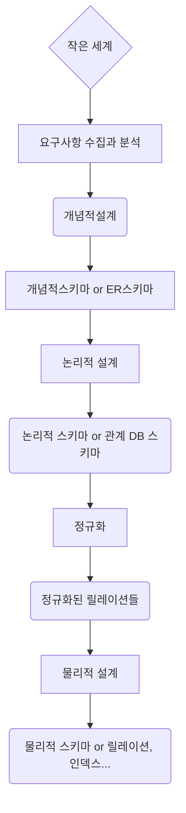

## 개념적 설계

   - ER 모델

**논리적 설계**

* DBMS의 특성을 고려
* 관계 DBMS에서는 ER 스키마를 릴레이션들로 사상

**물리적 설계**

* 하드웨어/운영 체제의 특성을 고려
* 성능상의 요구사항


**요구사항 분석**

* 기존의 문서를 조사하고, 인터뷰나 설문 조사
* 요구사항에 관한 지식을 기반으로
  	* 관련있는 엔티티들과 그들의 애트리뷰트가 무엇인지
  	* 엔티티들 간 관계를 파악


* 물리적인 사항과 독립적으로, 한 조직체에서 사용되는 정보의 모델을 구축하는 과정
* 대표적 데이터 모델 : ER모델
* 엔티티 타입, 관계 타입, 애트리뷰트 들을 식별
* 완성된 개념적 스키마(ER 스키마)는 **ER 다이어그램**으로 표현


## ER 모델

ER(**E**nitity **R**elation) 모델


<br/>

* 각 값마다 틀린 값을 가지는 경우 해당 애트리뷰트 밑에 **"_"** 를 붙임


### 엔티티

* 하나의 엔티티는 **사람, 장소, 사물, 사건** 등과 같이 독립적으로 존재하며 고유하게 식별 가능한 실세계의 객체
* 직원처럼 실체가 있는 것도 있지만, 수강과 같이 추상적인 것도 존재   


## 애트리뷰트

* 하나의 엔터티는 연관된 애트리뷰트들의 집합
  * Ex) 사원 엔티티는 사원번호, 이름, 직책, 급여등의 애트리뷰트를 보유

   - 타원으로 표시

  * 특수한 애트리뷰트
     * 복합 애트리뷰트
     * 다치 애트리뷰트
     * 유도된 애트리뷰트


## 관계

* 관계는 엔티티들 사이에 존재하는 연결

* 요구사항 분석에서 동사는 ER다이어그램에서 관계로 표현

* ER 다이어그램에서 다이아몬드로 표현됨

  

  ### 2진관계

  * 테이블 2개를 연결하는 것

    Ex) 부서와 직원 테이블을 근무하다로 연결

  

  

  ```
  erDiagram
  추후에 추가
  ```

  

  <br/>


* 예시

   - 부서 테이블:

      * 부서번호

      * 부서명

      * 위치

        

   - 직원 테이블:

      * 직원번호
      * 이름
      * 주민번호
      * 직책
      * 주소
        	* 시, 구, 동, 호....
      * 나이
      * ....

     <br/>

```
erDiagram
추후에 추가
```


```
erDiagram
추후에 추가
```

```
erDiagram
추후에 추가
```


* 직원 테이블의 주소의 경우 시, 구, 동 등 모든 정보가 필요로 함

  이를 복합 애트리뷰트라고 함

* 나이의 경우 주민번호를 통하여 계산 가능함

  이를 유도된 애트리뷰트라고 함

  


## 카디날리티

* 관계를 1:1, 1:N, M:n으로 구분

* 위의 부서 테이블과 직원 테이블의 경우 '부서'라는 테이블에 '직원'이 여러 명이 있는 형태임

  이를 관계로 나타내면 1:N의 비율이다.

* 또한 학교 데이터베이스를 ERD로 나타낼 경우 교과목 - 학생은 M:N의 비율로 나타나게 된다.
* 


## 참고 문서

https://www.edrawsoft.com/er-diagram-symbols.html


