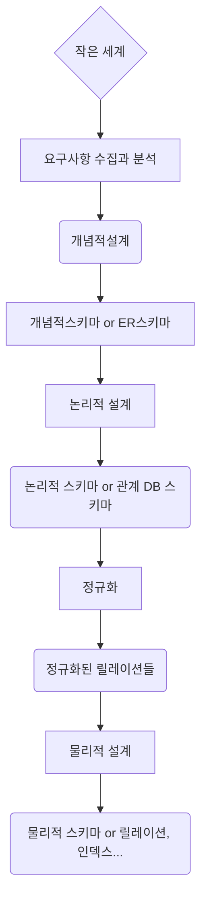
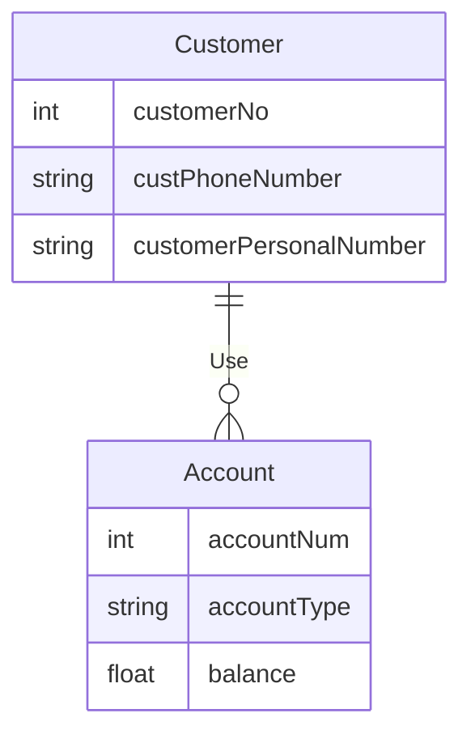

 

## 1진 관계

(9:20)

 

## 다중 관계

## 약한 엔티티

- 키를 형성하기에 충분한 애트리뷰트 들을 갖지못한 엔티티
- 이중선 직사각형으로 표기
- 부분 키(partial key)
  - 부양가족의 이름처럼 한 사원에 속한 부양가족 내에서는 서로 다르지만, 회사 전체 사원들의 부양가족들 전체에서는 같은 경우가 생길 수 있는 애트리뷰트
  - 부분 키는 점선 밑줄을 그어 표시

## 역할 쓰기

- 1진 관계일 때 의미를 명확하게 하기 위해 간선 위에 씀

## ERD 예시

1. 

​	B은행에서 고객 관리를 위해 **고객ID, 고객명, 주민번호, 연락처 정보**가 필요함

​	계좌 관리를 위해 **계좌 번호, 계좌 유형, 잔액** 정보가 필요

​	고객 1명은 여러 개의 계좌를 가질 수 있으며, 하나의 계좌는 한명의 고객이 소유

- 이 예시는 1:3의 1:N 비율을 가짐

 

2.

- 회사에는 다수의 사원들이 재직

- 각 사원에 대해 **사원 번호(고유), 이름, 직책, 급여, 주소** 저장	

  - 주소는 시,구,동으로 세분해 나타냄

  

- 각 사원은 0명 이상의 부양 가족을 *가질 수 있음* - 동사

  -  한 부양 가족은 두 명 이상의 사원에게 속하지 X
  - 각 부양가족에 대해 부양가족의 **이름, 성별** 저장 - **약한 엔티티**

  

- 회사는 여러개의 프로젝트 진행

  - 각 프로젝트에 대해 **프로젝트번호(고유), 이름, 예산, 프로젝트**가 진행되는 **위치** 나타냄
  - 한 프로젝트는 여러 곳에서 진행 가능
  - 각 프로젝트마다 여러 명의 사원이 존재
  - 각 사원은 여러 프로젝트에서 근무 가능하며 , 해당 프로젝트에서 어떤 **역할**을 수행하고, 얼마 동안 **근무했는지를** 나타냄
  - 각 프로젝트마다 한 명의 프로젝트 관리자가 존재 **->** 따로 엔터키는 X(사원)
  - 한 사원은 두 개 이상의 프로젝트 관리자가 될 수 없으며, 프로젝트 관리자 임무를 시작한 **날짜**를 기록함

  

- 각 사원은 한 부서에만 속함

  - 각 부서에 대해 **부서번호(고유), 이름, 부서 층** 나타냄

  

- 각 프로젝트에는 부품이 필요

  - 한 부품이 두 개 이상 프로젝트에서 사용 가능
  - 하나의 부품은 다른 여러개의 부품들로 이루어질수 있음
  - 각 부품에 대해 **부품번호(고유), 이름, 가격**  그리고 그 부품이 다른 부품들을 포함 할 경우 그 부품들에 대한 정보도 나타냄

  

- 각 부품을 공급하는 공급자가 존재

  - 한 명의 공급자는 여러 부품들을 공급 가능함
  - 각 부품은 여러 공급자들로부터 공급될 수 있음
  - 각 공급자에 대해 **공급자번호(고유), 이름, 신용도** 나타냄
  - 각 공급자에 대해 그 공급자가 어떤 부품을 어떤 프로젝트에 얼마나 공급하는가를 나타냄

- **회사 자체는 엔티티가 X**

 

